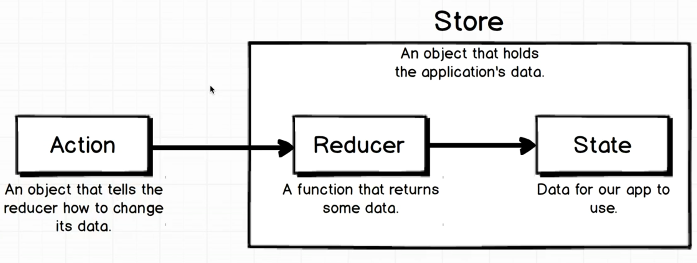

# The Basics of Redux

- **Store** - An object that hold's the application data.
- **Action** - An onject that tells the reducer how to change its data.
- **Reducer** - A function that returns some data.
- **State** - Data for our app to use.

